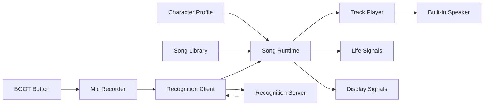

# BandToy Architecture

## Current PoC System

Each character contains:

- Character Profile
- Song Runtime
- Track Player
- Recognition Client
- Recognition Server
- Life Signals
- Display Signals

## Song Model

A song is a collection of tracks that share one tempo.

Each track is a sequence of timed notes:

- pitch in Hz
- duration in beats
- optional rest

For the first demo, timing is intentionally simple and deterministic. MIDI,
swing, velocity, and expressive timing can come later.

## Recognition Model

The current server only recognizes Twinkle Twinkle Little Star. The algorithm is
deliberately small:

- Parse raw PCM or WAV.
- Resample to 16 kHz.
- Estimate pitch on short frames.
- Convert pitch to rounded MIDI note numbers.
- Slide the observed note contour across the built-in Twinkle reference.
- Return the best match score and song position.

This is enough to validate the product moment: the toy hears a familiar melody
and joins.

## Join Model

The server returns `join_after_ms`, the time from the matched position to the
next bar. The firmware waits for that duration, then starts the harmony track.

This is intentionally expressive rather than perfect. The current implementation
does not yet compensate for recording duration, HTTP latency, recognition time,
or playback startup latency.

## Future Sync Model

Leader broadcasts:

- protocol version
- song id
- bpm
- start time
- bar count

Follower receives the broadcast and schedules a local start after a musical
delay, such as one bar.

The delay is intentional. Perfect instant sync feels like a machine. A small
ritual delay feels like a character joining.

## Latency Budget

The first prototype does not need sub-10 ms musical precision. It needs stable
enough timing for a charming duet.

Target:

- Discovery: under 500 ms.
- Join delay: exactly 1 or 2 bars by design.
- Track drift: small enough that the duet still feels intentional over one
  short song.

## Future Direction

Phase 1: multiple roles over ESP-NOW.

Phase 2: microphone-based discovery.

Phase 3: mechanical sound sources.

Phase 4: MIDI import and track splitting.

Phase 5: real-time following.

Phase 6: song learning between characters.
